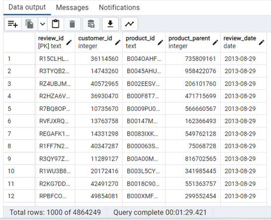

# Amazon_Vine_Analysis

Big Data - AWS services - PYSpark - pgAdmin

## Overview

The purpose of this project was to select a Vine review from the Amzon Database and determine if the bias of reviewers.   One program
used in this project was PySpark which was accessed through Google Colabratory to perform ETL process to extract the data from Amazon. 
Once the data was extracted and filtered, we connected to AWS RDS instance, and loaded the transformed data into pgAdmin.  Through this
process, we can determine if the review process is bias towards paid reviewer veruses nonpaid reviewers.

## Results

### Deliverable 1

The Amazon dataset used in this analysis was for the toys.  The data was extracted through Colabratory.   From here the dtat was used to
create 4 dataframes to transform into pgAdmin.   These dataframes were: review_id_table, products_table, customers_table, and vine_table.

### review_id_table

### products_table

### customers_table

)

### vine_table

### Deliverable 2

I used the same extraction of the data for the Vine analysis as in the Amazon dat frame extraction.   The analysis consisted of creating tables
for the total voters, 20 or more votes, helpful votes are greater than 50%, filtered if vine review existed or not, and finally the percentage 
of reviews for Vine and non Vine reviews.
